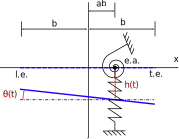

# Getting Started

```@setup guide
# this is placed here to pre-install matplotlib so the documentation doesn't get cluttered with the installation print statements.
using Plots
pyplot()
nothing #hide
```

In this guide we introduce you to the basic functionality of this package in a step by step manner.  This is a good starting point for learning about how to use this package.  For more details about how to use a particular model, the model documentation is likely a better resource.  For more examples of how to use this package see the [examples](@ref Examples).

If you haven't yet, now would be a good time to install AerostructuralDynamics.  AerostructuralDynamics can be installed from the Julia REPL by typing `]` (to enter the package manager) and then running the following command.
```julia
pkg> add https://flow.byu.edu/AerostructuralDynamics.jl
```

Now, that the package is installed we need to load it so that we can use it.

```@example guide
using AerostructuralDynamics
nothing #hide
```

For the purposes of this guide, we will be working with a two-degree-of-freedom typical section model, as shown in the following figure.



Our goal is to create an 2D aeroelastic model which we can use to simulate the behavior of this system.

## Initializing the Aeroelastic Model

For the aerodynamic model, we will be using Peter's finite state model with four aerodynamic state variables.  For the structural model, we will be using the typical section model.  To couple these models together, we use the [`couple_models`](@ref) function.  

```@example guide
aerodynamic_model = Peters{4}() # we use four aerodynamic state variables
structural_model = TypicalSection()
coupled_model = couple_models(aerodynamic_model, structural_model)
nothing #hide
```

## Defining State Variables, Inputs, and Parameters

The governing equations for all models in this package may be expressed as the first order ordinary differential equation
```math
M(x,y,p,t)\dot{x} = f(x,y,p,t)
```
where ``M(x,y,p,t)`` is a function which defines the mass matrix corresponding to the differential equation, ``f(x, y, p, t)`` is a function which defines the mass matrix multiplied state rates, ``x`` is a vector of states, ``y`` is a vector of inputs/coupling variables, ``p`` is a vector of parameters, and ``t`` is the current time.

As described in the documentation for [`Peters`](@ref), the state, input, and parameter vectors for the aerodynamic model are
```math
x_\text{aero} = \begin{bmatrix} \lambda_1 \\ \lambda_2 \\ \vdots \\ \lambda_N \end{bmatrix} \quad
y_\text{aero} = \begin{bmatrix} u \\ v \\ \omega \end{bmatrix} \quad
p = \begin{bmatrix} a \\ b \\ a_0 \\ \alpha_0 \end{bmatrix}
```
where ``\lambda_1, \lambda_2, \dots, \lambda_N`` are the aerodynamic states,
``u`` is the chordwise freestream velocity, ``v`` is the normal freestream velocity, ``\omega`` is the angular freestream velocity, ``a`` is the normalized reference location relative to the semi-chord, ``b`` is the semi-chord, ``a_0`` is the section lift slope, and ``\alpha_0`` is the section zero lift angle of attack.  Positive freestream velocity components are defined as shown in the following figure.


As described in the documentation for [`TypicalSection`](@ref), the state, input, and parameter vectors for the typical section model are defined as
```math
x_\text{stru} = \begin{bmatrix} h \\ \theta \\ \dot{h} \\ \dot{\theta} \end{bmatrix} \quad y_\text{stru} = \begin{bmatrix} \mathcal{L} \\ \mathcal{M} \end{bmatrix} \quad p_\text{stru} = \begin{bmatrix} k_h \\ k_\theta \\ m \\ S_\theta \\ I_\theta \end{bmatrix}
```
where ``h`` is plunge, ``\theta`` is pitch, ``\mathcal{L}`` is the lift per unit span, ``\mathcal{M}`` is the moment per unit span about the reference point, ``k_h`` is the linear spring constant, and ``k_\theta`` is the torsional spring constant, ``m`` is the mass per unit span, ``S_\theta`` is the structural imbalance, and ``I_θ`` is the mass moment of inertia about the reference point.

The state variables and inputs of a coupled model correspond to the state variables and inputs of its component models concatenated.  The parameters of a coupled model correspond to the parameters of its component models concatenated, followed by additional parameters which are specific to the coupled model.  As noted in the coupled model's documentation, the additional parameters introduced by the coupled model is the freestream velocity ``U_\infty`` and air density ``\\rho``.  The state, input, and parameter vectors for the coupled model are therefore
```math
x_\text{coupled} = \begin{bmatrix} \lambda_1 \\ \lambda_2 \\ \vdots \\ \lambda_N \\ h \\ \theta \\ \dot{h} \\ \dot{\theta} \end{bmatrix} \quad y_\text{coupled} = \begin{bmatrix} u \\ v \\ \omega \\ \mathcal{L} \\ \mathcal{M} \end{bmatrix} \quad p_\text{coupled} = \begin{bmatrix} a \\ b \\ a_0 \\ \alpha_0 \\ k_h \\ k_\theta \\ m \\ S_\theta \\ I_\theta \\ U_\infty \\ \rho \end{bmatrix}
```

```@example guide
# state variables
x_coupled = zeros(number_of_states(coupled_model))

# non-dimensional parameters
a = -1/5 # reference point normalized location
e = -1/10 # center of mass normalized location
μ = 20 # = m/(ρ*pi*b^2) (mass ratio)
r2 = 6/25 # = Iθ/(m*b^2) (radius of gyration about P)
σ = 2/5 # = ωh/ωθ (natural frequency ratio)
xθ = e - a
a0 = 2*pi # lift curve slope
α0 = 0 # zero lift angle
V = 1.0 # = U/(b*ωθ) (reduced velocity)

# chosen dimensional parameters
b = 1
ρ = 1
ωθ = 1

# derived dimensional parameters
m = μ*ρ*pi*b^2
Sθ = m*xθ*b
Iθ = r2*m*b^2
ωh = σ*ωθ
kh = m*ωh^2
kθ = Iθ*ωθ^2
U = V*b*ωθ

# parameter vector
p_aero = [a, b, a0, α0]
p_stru = [kh, kθ, m, Sθ, Iθ]
p_additional = [U, ρ]
p_coupled = vcat(p_aero, p_stru, p_additional)

nothing #hide
```

For coupled models, inputs are calculated as a function of the model states, model parameters, and current time using the [`get_inputs`](@ref) function.  For uncoupled models, inputs are provided by the user.

```@example guide
t = 0 # time

y_coupled = get_inputs(coupled_model, x_coupled, p_coupled, t) # inputs
nothing #hide
```

## Performing a Stability Analysis

The stability of a model for a given set of state variables, inputs, and parameters may be determined by calling the [`get_eigen`](@ref) function, which returns eigenvalues, left eigenvectors, and right eigenvectors.  For nonlinear systems, the provided state variables must correspond to an equilibrium point for the stability analysis to be theoretically valid.  In our case, our aeroelastic system is linear, so all sets of state variables yield the same result.

```@example guide
λ, U, V = get_eigen(coupled_model, x_coupled, y_coupled, p_coupled, t)
nothing #hide
```

A positive real part corresponding to any eigenvalue returned from the [`get_eigen`](@ref) function indicates that the system is unstable for the provided set of state variables, inputs, and parameters.

## Performing a Simulation

To simulate the behavior of our model we first need to create an object of type `DifferentialEquations.ODEFunction` using [`get_ode`](@ref).  Then the [DifferentialEquations](https://github.com/SciML/DifferentialEquations.jl) package may be used to solve the ordinary differential equation corresponding to the model.

```@example guide
using DifferentialEquations

# non-zero plunge degree of freedom
u0 = [0.0, 0.0, 0.0, 0.0, 1.0, 0.0, 0.0, 0.0]

# simulate for 10 seconds
tspan = (0.0, 10.0)

# construct ODE function
f = get_ode(coupled_model)

# construct ODE problem
prob = DifferentialEquations.ODEProblem(f, u0, tspan, p_coupled)

# solve ODE
sol = DifferentialEquations.solve(prob)

```
